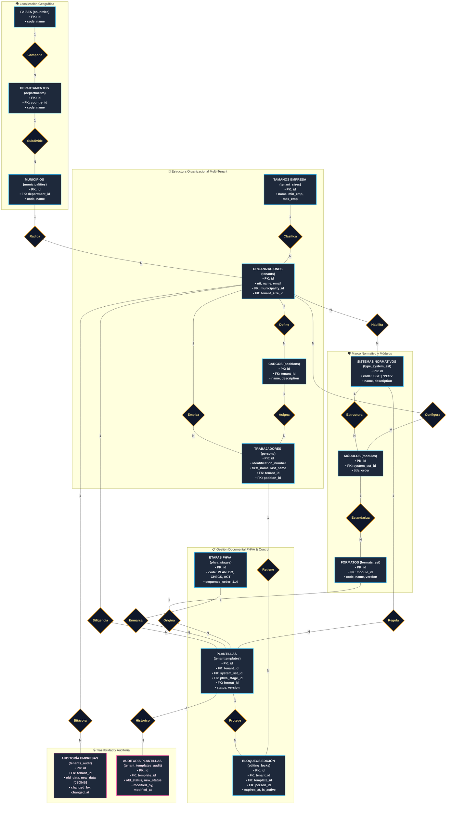

# Modelo Conceptual - Notación de Chen 📐🛡️
### *Sistema Multi-Tenant de Gestión SST & PESV en PostgreSQL 16*
**Autor:** Julian Andrey Ricaurte ([@juliand06](https://github.com/juliand06))

---

## 📌 1. Simbología Formal de Chen Utilizada

| Elemento | Símbolo en Notación Chen | Representación en el Diagrama | Descripción |
| :--- | :---: | :---: | :--- |
| **Entidad Fuerte** | Rectángulo | `[ Entidad ]` | Objeto del mundo real con existencia independiente y clave primaria propia. |
| **Relación** | Rombo | `{ Relación }` | Asociación lógica entre dos o más entidades. |
| **Cardinalidad** | `(1) / (N) / (M)` | Etiquetas sobre los arcos | Determina cuántas instancias de una entidad pueden asociarse con otra. |
| **Clave Primaria (PK)** | Subrayado / `[PK]` | Resaltado en negrita y etiqueta | Atributo único e irrepetible que identifica la tupla. |
| **Clave Foránea (FK)** | Línea discontinua / `[FK]` | Resaltado con etiqueta `[FK]` | Atributo que garantiza la integridad referencial con la entidad padre. |

---

## 🏛️ 2. Diagrama Conceptual Completo (Notación Chen)

El siguiente diagrama utiliza la notación estándar de Peter Chen mediante bloques semánticos para evitar sobreposición de líneas:

---

## 🔍 3. Matriz Semántica de Entidades, Relaciones y Cardinalidades

| Entidad Origen | Relación (Rombo) | Entidad Destino | Cardinalidad | Clave Foránea (`FK`) Involucrada | Regla de Negocio / Semántica |
| :--- | :---: | :--- | :---: | :--- | :--- |
| **`countries`** | `{Compone}` | `departments` | **$1:N$** | `departments.country_id` | Un país contiene múltiples departamentos o regiones territoriales. |
| **`departments`** | `{Subdivide}` | `municipalities` | **$1:N$** | `municipalities.department_id` | Un departamento se subdivide en varios municipios. |
| **`municipalities`** | `{Radica}` | `tenants` | **$1:N$** | `tenants.municipality_id` | Cada organización radica legalmente en un municipio. |
| **`tenant_sizes`** | `{Clasifica}` | `tenants` | **$1:N$** | `tenants.tenant_size_id` | Clasificación por volumen de empleados (Micro, Pequeña, Mediana, Gran). |
| **`tenants`** | `{Define}` | `positions` | **$1:N$** | `positions.tenant_id` | Aislamiento multi-tenant: los cargos pertenecen exclusivamente a su tenant. |
| **`tenants`** | `{Emplea}` | `persons` | **$1:N$** | `persons.tenant_id` | Cada trabajador está adscrito a una organización tenant. |
| **`positions`** | `{Asigna}` | `persons` | **$1:N$** | `persons.position_id` | Un trabajador tiene un cargo asignado (validado por trigger multi-tenant). |
| **`tenants`** | `{Habilita}` | `type_system_sst` | **$N:M$** | `tenantsystems` *(tabla puente)* | Una empresa puede habilitar SST, PESV o ambos sistemas simultáneamente. |
| **`type_system_sst`**| `{Estructura}` | `modules` | **$1:N$** | `modules.system_sst_id` | Cada sistema normativo organiza sus requisitos en módulos temáticos. |
| **`tenants`** | `{Configura}` | `modules` | **$N:M$** | `tenant_modules` *(tabla puente)* | Cada empresa suscribe los módulos específicos que requiere operar. |
| **`modules`** | `{Estandariza}`| `formats_sst` | **$1:N$** | `formats_sst.module_id` | Los formatos normalizados se agrupan por módulo funcional. |
| **`phva_stages`** | `{Enmarca}` | `tenanttemplates` | **$1:N$** | `tenanttemplates.phva_stage_id` | Cada documento pertenece a una etapa continua (Planear, Hacer, Verificar, Actuar). |
| **`formats_sst`** | `{Origina}` | `tenanttemplates` | **$1:N$** | `tenanttemplates.format_id` | Una plantilla documental se origina a partir de un formato institucional. |
| **`tenants`** | `{Diligencia}` | `tenanttemplates` | **$1:N$** | `tenanttemplates.tenant_id` | Las plantillas pertenecen de forma aislada a cada empresa. |
| **`tenanttemplates`**| `{Protege}` | `editing_locks` | **$1:N$** | `editing_locks.template_id` | Control de concurrencia: bloqueos temporales por documento. |
| **`persons`** | `{Retiene}` | `editing_locks` | **$1:N$** | `editing_locks.person_id` | Identifica qué trabajador posee el bloqueo activo de edición. |
| **`tenants`** | `{Bitácora}` | `tenants_audit` | **$1:N$** | `tenants_audit.tenant_id` | Histórico de cambios en datos y estado en formato JSONB. |
| **`tenanttemplates`**| `{Histórico}` | `tenant_templates_audit`| **$1:N$** | `tenant_templates_audit.template_id`| Trazabilidad de estados (borrador $\rightarrow$ pendiente $\rightarrow$ finalizado). |

---

## 🎯 4. Reglas de Integridad y Aislamiento Multi-Tenant

1. **Aislamiento de Cargos y Personal (Trigger `trg_validate_person_position_tenant`):**  
   Una persona solo puede ser vinculada a un cargo (`position_id`) cuya propiedad pertenezca al mismo `tenant_id`. No se permiten cruces entre organizaciones distintas.
2. **Ciclo PHVA Integral:**  
   Las plantillas documentales se vinculan obligatoriamente a una de las cuatro fases del ciclo (`sequence_order` 1 a 4), garantizando que las consultas de avance porcentual puedan agrupar y ponderar cada etapa del proceso de mejora continua.
3. **Control de Concurrencia Optimista/Pesimista:**  
   La entidad `editing_locks` contiene una restricción de chequeo (`expires_at > locked_at`) y un trigger de desactivación automática para asegurar que ningún recurso quede retenido de forma permanente.
