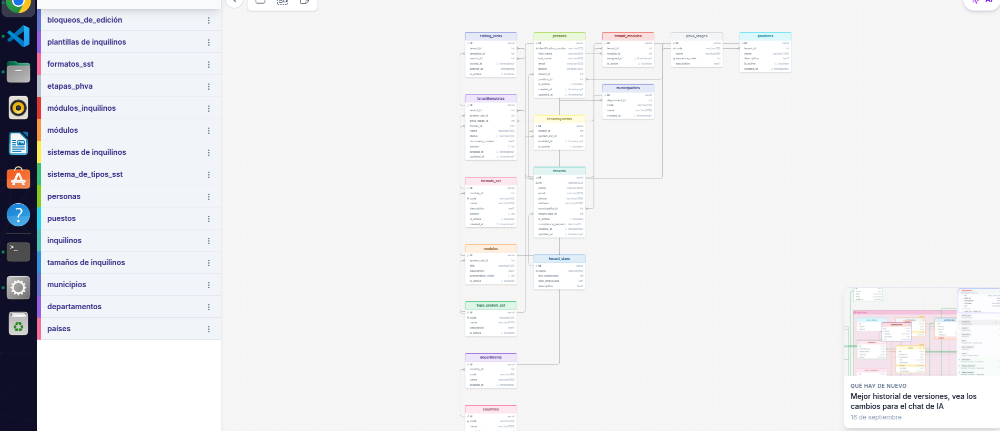

# Plataforma Multi-Tenant para Gestión de SST & PESV 🛡️🚛
### *Sistema de Gestión de Seguridad y Salud en el Trabajo & Plan Estratégico de Seguridad Vial en PostgreSQL*


---

## 📌 1. Descripción del Proyecto

Este proyecto consiste en el diseño, implementación, optimización y automatización de una base de datos relacional de nivel empresarial bajo arquitectura **Multi-Tenant** en **PostgreSQL 16**.

El sistema permite a múltiples organizaciones (*tenants*) administrar, auditar y dar cumplimiento normativo a sus programas de:
1. **SST:** Sistema de Gestión de la Seguridad y Salud en el Trabajo (*Decreto 1072 de 2015 / Resolución 0312 de 2019*).
2. **PESV:** Plan Estratégico de Seguridad Vial (*Resolución 40595 de 2022 del Ministerio de Transporte*).

El diseño garantiza:
* **Aislamiento Lógico Multi-Tenant:** Cada registro operativo está estrictamente acotado al identificador de la organización (`tenant_id`).
* **Normalización formal hasta Cuarta Forma Normal (4NF):** Eliminación de redundancias y dependencias multivaluadas.
* **Ciclo PHVA (Planear, Hacer, Verificar, Actuar):** Clasificación de plantillas y formatos documentales según la etapa de mejora continua.
* **Programación en PL/pgSQL:** 15 procedimientos almacenados, 8 funciones (escalares y tabulares) y 15 triggers para integridad, validación y auditoría automática.
* **Vistas de Alto Rendimiento:** 5 vistas estándar y 3 vistas materializadas con índices únicos para consultas consolidadas e indicadores de cumplimiento.

---

## 🏛️ 2. Arquitectura de Datos y Modelo Entidad-Relación

### Diagrama Físico Relacional (DrawSQL)


### Estructura Lógica de Entidades

```
[ Países ] ──( 1:N )── [ Departamentos ] ──( 1:N )── [ Municipios ]
                                                            │ (1:N)
                                                            ▼
[ Tamaños de Empresa ] ───────( 1:N )────────────► [ Organizaciones (Tenants) ]
                                                            │
    ┌───────────────────────┬───────────────────────────────┼────────────────────────┐
    │ (1:N)                 │ (1:N)                         │ (1:N)                  │ (1:N)
    ▼                       ▼                               ▼                        ▼
[ Cargos (Positions) ]  [ Personas (Persons) ]      [ Tenants-Sistemas ]     [ Tenants-Módulos ]
    │                       │                               │                        │
    └──────( 1:N )──────────┘                               ▼                        ▼
                                                    [ Tipos Sistemas ] ──(1:N)── [ Módulos ]
                                                            │                        │
                                                            │                        ▼ (1:N)
                                                            │                  [ Formatos SST ]
                                                            ▼                        │
[ Etapas PHVA ] ────────────( 1:N )──────────────► [ Plantillas (TenantTemplates) ] ◄┘
                                                            │
                                ┌───────────────────────────┴───────────────────────────┐
                                │ (1:N)                                                 │ (1:N)
                                ▼                                                       ▼
                    [ Bloqueos (Editing Locks) ]                        [ Auditoría Plantillas ]
```

---

## 🗂️ 3. Estructura del Repositorio

El repositorio adopta el estándar de desarrollo con **Docker Compose** y **VS Code Dev Containers**:

```text
exam-postgres/
├── .devcontainer/
│   ├── Dockerfile                  # Entorno devcontainer con postgresql-client, git, curl
│   ├── devcontainer.json           # Configuración de extensiones y puertos de VS Code
│   └── devcontainer-lock.json      # Bloqueo de dependencias de la imagen devcontainer
├── init/                           # Pipeline de inicialización automática de PostgreSQL
│   ├── 01_ddl.sql                  # Definición del esquema (tablas, llaves, restricciones e índices)
│   ├── 02_sp_fn.sql                # 15 Procedimientos Almacenados y 8 Funciones PL/pgSQL
│   ├── 03_triggers.sql             # 15 Triggers de validación, integridad y auditoría
│   ├── 04_seed_data.sql            # Datos de prueba para organizaciones colombianas
│   └── 05_views.sql                # 5 Vistas estándar y 3 Vistas Materializadas
├── sql/
│   └── consultas.sql               # Banco completo con las 68 consultas del examen
├── .env.example                    # Plantilla de variables de entorno
├── docker-compose.yml              # Orquestación de workspace, postgres_db y pgadmin_web
├── servers.json                    # Registro automático del servidor en pgAdmin 4
└── README.md                       # Documentación técnica completa
```

---

## ⚡ 4. Guía de Despliegue y Ejecución Rápida

### Requisitos
* [Docker Desktop](https://www.docker.com/) o Docker Engine con Docker Compose v2+.
* [Git](https://git-scm.com/) instalado.
* [Visual Studio Code](https://code.visualstudio.com/) (opcional, para uso con Dev Containers).

### Paso 1: Configurar variables de entorno
```bash
cp .env.example .env
```

### Paso 2: Levantar el entorno con Docker Compose
```bash
docker compose up -d --build
```

El servicio `postgres_db` ejecuta automáticamente todos los scripts de `./init` en orden secuencial (`01` a `05`). Una vez que la base de datos supera su `healthcheck`, inician `workspace` y `pgadmin_web`.

---

## 🔌 5. Parámetros de Conexión a los Servicios

| Servicio | Host (Externo) | Puerto Host | Credenciales / Base de Datos |
| :--- | :--- | :--- | :--- |
| **PostgreSQL 16** | `localhost` | `5433` | **BD:** `bkddb` <br> **Usuario:** `bkseducate` <br> **Password:** `bkseducate2026` |
| **pgAdmin 4** | [http://localhost:8081](http://localhost:8081) | `8081` | **Email:** `admin@example.com` <br> **Password:** `SuperBks123!` |
| **Workspace** | Contenedor interno | - | Usuario `root`, CLI de PostgreSQL preinstalado |

> **Nota para gestores externos (DBeaver, DataGrip, VS Code SQLTools):** Conéctate a `localhost` en el puerto **`5433`** con la base de datos **`bkddb`**.  
> En **pgAdmin 4** en web, el host interno de red es **`postgres_db`** (puerto `5432`), el cual ya viene preconfigurado en `servers.json`.

---

## 🧪 6. Verificación y Ejecución de Consultas

### Conectarse a la consola interactiva psql
```bash
docker compose exec -it postgres_db psql -U bkseducate -d bkddb
```

### Ejecutar todo el banco de consultas del examen
```bash
docker compose exec -T postgres_db psql -U bkseducate -d bkddb -f /docker-entrypoint-initdb.d/../workspace/sql/consultas.sql
```
*(O desde el host: `cat sql/consultas.sql | docker compose exec -T postgres_db psql -U bkseducate -d bkddb`)*

---

## 📊 7. Resumen de Componentes Implementados

### Procedimientos Almacenados (15)
1. `sp_register_tenant`: Registro de organización validando unicidad de NIT.
2. `sp_register_person`: Registro de persona con validación de pertenencia de cargo al tenant.
3. `sp_toggle_tenant_status`: Activación / desactivación de empresas.
4. `sp_assign_module_to_tenant`: Asignación idempotente de módulos a organizaciones.
5. `sp_enable_system_to_tenant`: Habilitación de sistemas SST/PESV por tenant.
6. `sp_assign_template_to_tenant`: Asignación de plantillas documentales.
7. `sp_change_person_position`: Cambio de cargo dentro del mismo tenant.
8. `sp_transfer_person`: Traslado de personal entre organizaciones con actualización relacional.
9. `sp_deactivate_tenant_modules`: Desactivación de módulos de empresas inactivas.
10. `sp_delete_module_assignment`: Eliminación controlada de módulo validando dependencias.
11. `sp_count_tenant_templates`: Conteo de plantillas con notificación `RAISE NOTICE`.
12. `sp_calculate_tenant_compliance`: Cálculo y persistencia del porcentaje de cumplimiento.
13. `sp_count_templates_by_phva`: Conteo de documentos por tenant y etapa PHVA.
14. `sp_update_tenant_contact`: Actualización simultánea de contactos y `updated_at`.
15. `sp_safe_assign_template`: Asignación con bloque `EXCEPTION` transaccional.

### Funciones Almacenadas (8)
1. `fn_total_persons_by_tenant(id)`: Retorna el número de trabajadores del tenant.
2. `fn_tenant_compliance_percentage(id)`: Retorna el porcentaje numérico de cumplimiento.
3. `fn_has_module_enabled(tenant_id, module_id)`: Retorna booleano de disponibilidad.
4. `fn_get_person_full_name(id)`: Retorna nombres y apellidos concatenados.
5. `fn_count_templates_by_stage(tenant_id, stage_id)`: Total de plantillas por etapa PHVA.
6. `fn_get_tenant_modules(tenant_id)`: Función tabular de módulos asignados.
7. `fn_get_tenant_persons_positions(tenant_id)`: Función tabular de personal y cargos.
8. `fn_classify_compliance_level(percentage)`: Clasificación categórica ('Bajo', 'Medio', 'Alto').

### Triggers (15)
1. `trg_tenants_updated_at`: Actualización de marca temporal en `tenants`.
2. `trg_persons_updated_at`: Actualización de marca temporal en `persons`.
3. `trg_prevent_person_inactive_tenant`: Bloquea adición de personal en empresas inactivas.
4. `trg_prevent_duplicate_tenant_module`: Previene duplicidad de asignaciones de módulos.
5. `trg_prevent_template_inactive_tenant`: Previene asignación documental a empresas inactivas.
6. `trg_validate_person_position_tenant`: Valida que el cargo corresponda al tenant de la persona.
7. `trg_tenanttemplates_updated_at`: Actualización de marca temporal en plantillas.
8. `trg_prevent_delete_tenant_with_persons`: Impide borrar organizaciones con personal asignado.
9. `trg_prevent_delete_system_in_use`: Impide borrar sistemas normativos activos.
10. `trg_prevent_delete_module_in_use`: Impide borrar módulos asignados a tenants.
11. `trg_validate_compliance_range`: Valida rango del porcentaje entre 0.00 y 100.00.
12. `trg_audit_tenant_changes`: Bitácora JSONB de cambios principales en organizaciones.
13. `trg_audit_tenant_status_change`: Auditoría de cambios de estado activo/inactivo.
14. `trg_audit_template_changes`: Auditoría de modificaciones de estado en plantillas.
15. `trg_cleanup_expired_editing_locks`: Limpieza automática de bloqueos de edición expirados.

---

## 👨‍💻 Autor

* **Estudiante / Desarrollador:** Julian Andrey Ricaurte ([@juliand06](https://github.com/juliand06))
* **Correo Electrónico:** andreyricaurte10@gmail.com
* **Materia:** Bases de Datos en PostgreSQL - Gestión Multi-Tenant SST & PESV
* **Año:** 2026
